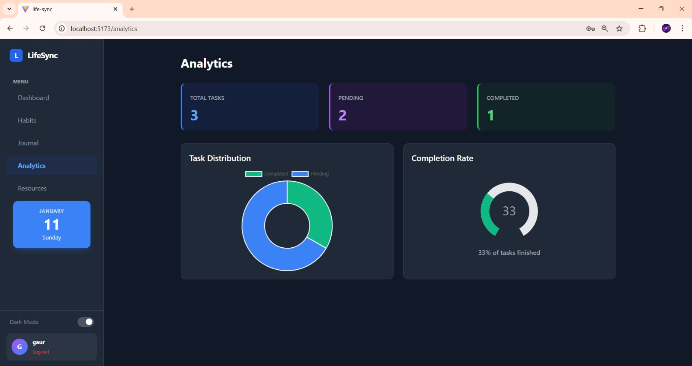
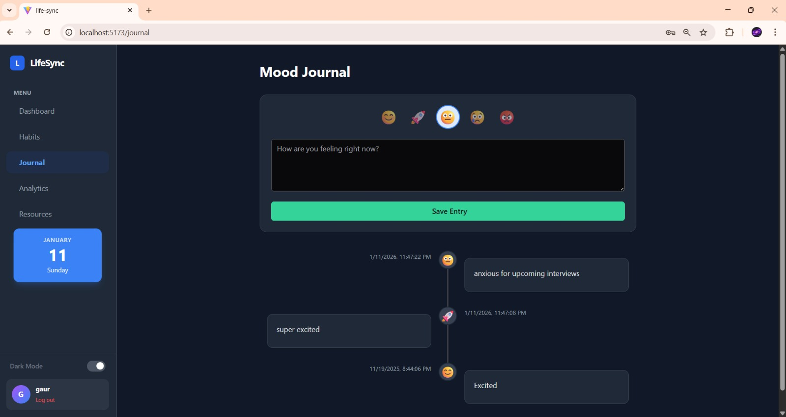
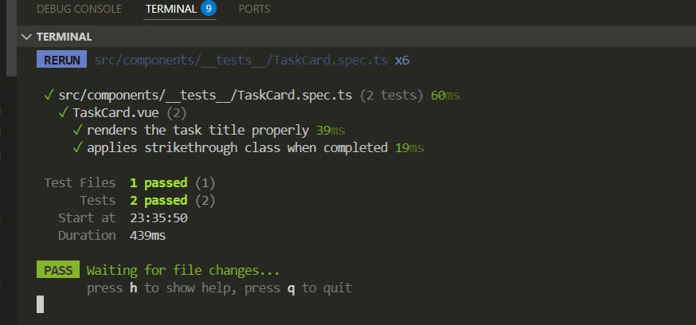
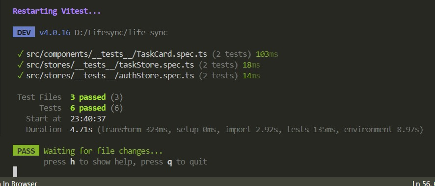

# 🌿 LifeSync

**LifeSync** is a comprehensive personal wellness and productivity dashboard designed to help users organize tasks, build consistent habits, and track their mental well-being. Built as a scalable Single Page Application (SPA) using the modern Vue 3 ecosystem.


## 🚀 Key Features

* **📝 Task Management:** Create, prioritize, and manage tasks with optimistic UI updates for a snappy experience.
* **🔥 Habit Tracker:** Gamified habit tracking with streak counters and consistency heatmaps.
* **📖 Mood Journal:** Timeline view to log thoughts and track emotional trends using a visual mood selector.
* **📊 Analytics Dashboard:** Real-time data visualization using Charts and Knobs to monitor completion rates and productivity distribution.
* **🧠 Resource Hub:** Curated mental health and developer resources fetched dynamically from external APIs.
* **🔐 Secure Authentication:** JWT-based login/register system with protected routes and persistent sessions.
* **🎨 Modern UI/UX:** Responsive design featuring **Dark/Light mode**, Glassmorphism effects, and interactive **PrimeVue** components.

---

## 🛠️ Tech Stack

### Frontend
* **Framework:** Vue.js 3 (Composition API, Script Setup)
* **Language:** TypeScript
* **Build Tool:** Vite
* **State Management:** Pinia (Centralized Stores for Auth, Tasks, Habits, Journal)
* **Styling:** Tailwind CSS, PrimeVue (Aura Theme)
* **Testing:** Vitest, Vue Test Utils, JSDOM

### Backend
* **Runtime:** Node.js
* **Framework:** Express.js
* **Database:** MongoDB & Mongoose
* **Authentication:** JSON Web Tokens (JWT) & BCrypt

---

## 📸 Screenshots

| **Dashboard (Dark Mode)** | **Analytics & Charts** |
|:---:|:---:|
|  |  |

| **Habit Tracker** | **Mood Journal** |
|:---:|:---:|
|  |  |

---

## 🧪 Testing & Reliability

This project emphasizes code quality and reliability. It features an automated testing suite utilizing **Vitest**.

* **Unit Tests:** Validates complex business logic in Pinia stores (Auth, Task stores).
* **Component Tests:** Ensures UI components render correctly under various states.
* **Mocking:** Utilizes `vi.mock` to simulate API calls, isolating frontend logic from backend dependencies.

### Running Tests

*Screenshot of passing tests:*





```bash
npm run test

*Screenshot of passing tests:*


---

## ⚙️ Getting Started

Follow these steps to set up the project locally.

### Prerequisites

* Node.js (v16+)
* MongoDB (Local or Atlas URL)

### 1. Clone the Repository

```bash
git clone [https://github.com/yourusername/life-sync.git](https://github.com/yourusername/life-sync.git)
cd life-sync

```

### 2. Setup Backend

```bash
cd server
npm install
# Create a .env file in /server with:
# MONGO_URI=your_mongodb_connection_string
# JWT_SECRET=your_secret_key
# PORT=5000

npm start

```

### 3. Setup Frontend

```bash
# Open a new terminal
cd .. # Go back to root
npm install

# Create a .env file in root with:
# VITE_API_URL=http://localhost:5000

npm run dev

```

The application will be available at `http://localhost:5173`.

---

## 📂 Project Structure

```text
src/
├── components/        # Reusable UI components (Sidebar, TaskCard, etc.)
│   └── __tests__/     # Component tests
├── composables/       # Shared logic (useDark, etc.)
├── router/            # Vue Router configuration & Navigation Guards
├── stores/            # Pinia State Management
│   ├── __tests__/     # Unit tests for Stores
│   ├── authStore.ts   # Authentication logic
│   └── taskStore.ts   # Task CRUD operations
├── views/             # Main page views (Dashboard, Habits, Analytics)
├── App.vue            # Main App Layout
└── main.ts            # Entry point (PrimeVue & Pinia setup)

```

## 📄 License

This project is open-source and available under the [MIT License](https://www.google.com/search?q=LICENSE).

---

### 👤 Author

Shriyanshi Gaur


```
